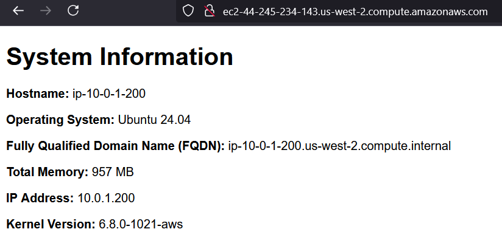

### Create New Keys ###

* Creates a new SSH key named aws in the .ssh folder.

```
ssh-keygen -t ed25519 -f ~/.ssh/aws -C "lab7"
```

### Run playbook ###

* From the ansible folder, runs the playbook using the inventory file in the inventory folder in the same directory, as specified in ansible.cfg.

```
ansible-playbook playbook.yml
```

### Screenshot of running instance ###



